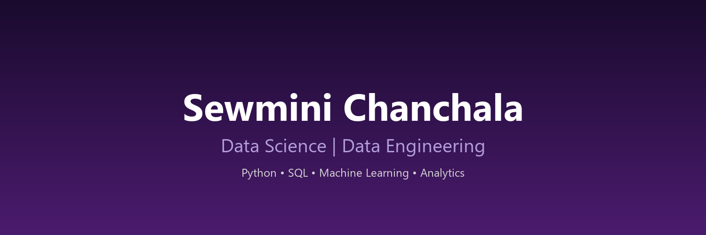

<!-- Profile Header -->

# Hi 👋, I'm Sewmini Chanchala

### Data Science | Data Engineering | Information Systems Undergraduate

---

# 👩‍💻 About Me

🎓 Information Systems Undergraduate at **University of Colombo School of Computing (UCSC)**

🚀 Aspiring **Data Scientist / Data Engineer**

💡 Passionate about:

- Data Engineering
- Machine Learning
- Data Analytics
- Artificial Intelligence
- Building intelligent systems

Currently working on creating real-world data projects involving:

- ETL pipelines
- Data visualization
- Machine learning models
- Analytics dashboards

---

# 🛠️ Tech Stack

## Programming Languages

## Data & Database

## Data Science Tools

## Development Tools

---

# 📚 Currently Learning

🌱 Data Engineering

- Advanced SQL
- Data Warehousing
- ETL Pipelines
- Apache Spark
- Cloud Platforms

🤖 Machine Learning

- Supervised Learning
- Deep Learning
- NLP
- AI Applications

☁️ Cloud

- AWS
- Snowflake
- Cloud Data Platforms

---

# 🚀 Featured Projects

## 🎵 PulseBeat Analytics

Music Intelligence Analytics Platform

Features:

✔ Data Pipeline  
✔ Data Cleaning  
✔ SQL Database  
✔ Analytics Dashboard  
✔ Data Visualization  

Technologies:

Python | Pandas | SQL | Power BI

---

## 🏦 World Bank Data ETL Pipeline

End-to-end ETL project extracting and transforming financial data.

Features:

✔ Web Scraping  
✔ Data Transformation  
✔ Database Loading  
✔ Logging System  

---

## 🧬 LifeConnect Sri Lanka

Organ Donation Management System

A complete database-driven healthcare management system.

Features:

✔ Donor Management  
✔ Hospital Management  
✔ Donation Tracking  
✔ User Roles

---

# 📊 GitHub Statistics

---

# 📈 Most Used Languages

---

# 🐍 Contribution Snake

---

# 📫 Connect With Me

---

### "Turning data into meaningful insights 🚀"

